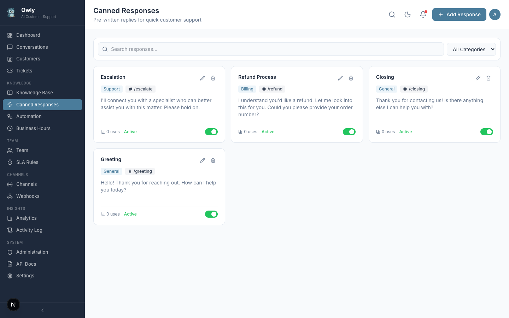

# Canned Responses

Canned responses are pre-written reply templates that help your team respond to common questions quickly and consistently. They save time and ensure that customers receive accurate, well-crafted answers every time.

*The Canned Responses page showing templates organized by category with shortcuts, usage counts, and active toggles.*

---

## Creating a Canned Response

1. Navigate to **Canned Responses** in the sidebar
2. Click **Add Response**
3. Fill in the template details:

| Field | Description | Example |
|-------|-------------|---------|
| Title | A descriptive name for the template | "Greeting - Standard Welcome" |
| Content | The full text of the reply | "Thank you for reaching out! How can I help you today?" |
| Category | A grouping label for organization | "Greetings" |
| Shortcut | A quick-access keyword starting with `/` | `/greeting` |
| Active | Whether this template is available for use | On |

4. Click **Save**

---

## Using Shortcuts in Conversations

When replying to a customer in the conversation view, you can use shortcuts to quickly insert a canned response.

### How to Use a Shortcut

1. Open a conversation
2. In the reply input, type the shortcut (for example, `/greeting`)
3. The shortcut will be replaced with the full canned response content
4. Review the text and send the message

### Shortcut Format

Shortcuts should follow these conventions:
- Always start with a `/` character
- Use lowercase letters and hyphens
- Keep them short and memorable

**Examples:**

| Shortcut | Purpose |
|----------|---------|
| `/greeting` | Standard welcome message |
| `/refund` | Refund policy explanation |
| `/hours` | Business hours information |
| `/thankyou` | Thank you and closing message |
| `/escalate` | Escalation acknowledgment |
| `/followup` | Follow-up promise message |

---

## Organizing by Category

Categories help you group related canned responses together. The category field is a free-text label, so you can create any grouping that makes sense for your business.

### Suggested Categories

| Category | What It Contains |
|----------|-----------------|
| Greetings | Welcome messages and conversation openers |
| Closings | Thank you messages and conversation closers |
| Policies | Refund, shipping, warranty, and other policy responses |
| Technical | Common technical support answers |
| Sales | Pricing, product info, and upsell responses |
| Escalation | Messages for when issues need human attention |

---

## Usage Tracking

Each canned response tracks how many times it has been used. This usage count is displayed on the Canned Responses page and helps you understand:

- Which responses are most popular (and should be kept up to date)
- Which responses are rarely used (and might need revision or removal)
- Patterns in customer inquiries (if "refund" is your most-used response, consider adding more knowledge base entries about your refund process)

---

## Best Practices for Canned Responses

### Keep Templates Conversational

Write canned responses in a natural, conversational tone that matches your business's communication style. Avoid overly formal or robotic language unless that matches your brand.

### Include Placeholders for Personalization

Consider adding bracketed placeholders that the agent can fill in before sending:

"Hi [Customer Name], thank you for your patience. Your order [Order Number] has been shipped and should arrive within [Timeframe]."

### Review and Update Regularly

- Review canned responses quarterly to ensure accuracy
- Update responses when policies, products, or processes change
- Remove responses that are no longer relevant
- Add new responses based on common questions you notice in conversations

### Create Responses for Every Stage

Make sure you have templates for the full conversation lifecycle:
1. **Opening** -- Greeting and acknowledgment
2. **Information gathering** -- Asking for details
3. **Resolution** -- Providing the answer or solution
4. **Closing** -- Thank you and sign-off
5. **Escalation** -- Handing off to a specialist

### Keep Content Accurate

Since canned responses bypass the AI's knowledge base, ensure that the information in your templates is accurate and current. Outdated information in a canned response can confuse customers.

---

## Next Steps

- [Conversations and Inbox](Conversations-and-Inbox) -- Use your canned responses when replying to customers
- [Knowledge Base Guide](Knowledge-Base-Guide) -- Add detailed information that the AI can use for questions not covered by canned responses
- [Automation Rules](Automation-Rules) -- Set up auto-reply rules that use templates
